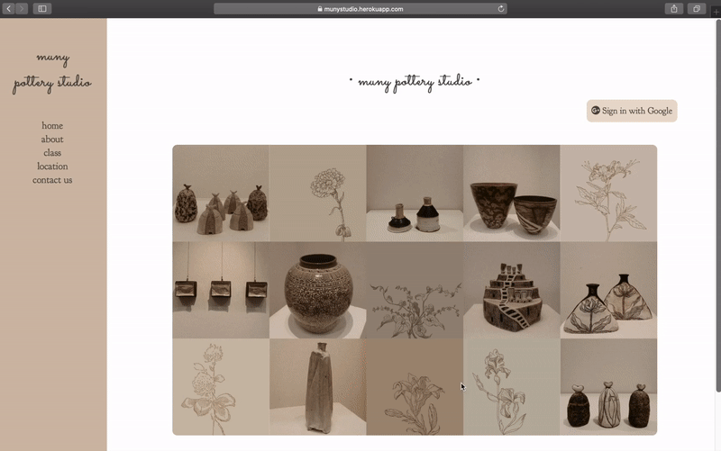

# Front-end Web Development - Muny Pottery Studio

<a href="http://munystudio.herokuapp.com" target="_blank">
&raquo; click here to see more
</a>

Web application using Heroku, Adobe Photoshop, HTML, CSS, Javascript, and Node.js thats market Muny pottery studio. Google Analytics is also integrated to analyze customer traffic and to continuously work on improving membership retention.
